# Mermaid Diagram Best Practices

This skill outlines guidelines for generating robust and error-free Mermaid diagrams, specifically addressing common issues like emoji usage and complex characters.

## 1. Avoid Emojis in Diagrams
While tempting for visual flair, emojis frequently cause rendering errors in various Mermaid implementations and CI/CD pipelines.

**Rule:** Do NOT use emojis in node identifiers, labels, or subgraph names.

### Bad Practice (Prone to errors)

```mermaid
graph TD
    A[User 👤] --> B{Valid? ✅}
    B -->|Yes| C[App 📱]
    B -->|No| D[Error ❌]
```


### Good Practice (Stable)


## 2. Use Simple Alphanumeric IDs
Node identifiers (the internal names used to link nodes) should be simple, short, and alphanumeric. Avoid spaces or special characters in the ID itself.

**Bad:**
`User Input --> Database Connection`
(Using the label as the ID can be ambiguous and break if labels change)

**Good:**
`user_input[User Input] --> db_conn[Database Connection]`

## 3. Escape Special Characters
If you must use special characters (like brackets `[]`, parentheses `()`, or quotes `""`) inside a label, ensure they are properly escaped or use the correct enclosure syntax.

- **Square Brackets**: `id[Text with [brackets]]` can break. Use `id["Text with [brackets]"]`.
- **Quotations**: `id[Text "quote"]` can break. Use `id['Text "quote"']` or `id["Text 'quote'"]`.

## 4. Direction
Stick to standard directions unless necessary:
- `TD` (Top-Down) or `LR` (Left-Right) are the most common and readable.

## 5. Subgraphs
When using subgraphs, ensure the ID is unique and does not conflict with node IDs.

```mermaid
subgraph sg_core [Core System]
    direction TB
    ...
end
```

## Summary Checklist
- [ ] No emojis in any part of the diagram.
- [ ] Node IDs are alphanumeric (e.g., `A`, `client_service`).
- [ ] Labels with special characters are wrapped in quotes.
- [ ] Diagram direction is appropriate (`TD` or `LR`).
