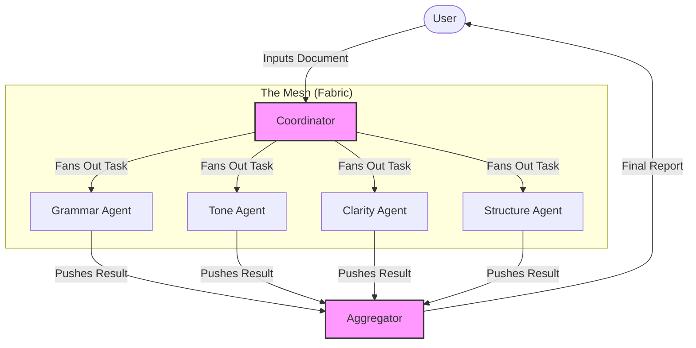

# Agentic Mesh - Tutorial & Reference Implementation

**Learn the Agentic Mesh Principle: A pragmatic approach to multi-agent distributed systems.**

This repository serves as a tutorial and reference implementation for building scalable, agentic architectures using Redis Streams and Python. It demonstrates how to decouple ingestion, coordination, specialist processing, and aggregation into a robust mesh of independent agents.

## What You Will Learn

- **The Agentic Mesh Principle**: How specialized agents (Grammar, Tone, Clarity) collaborate without direct coupling.
- **Event-Driven Coordination**: Using a Coordinator pattern to fan-out tasks dynamically.
- **Resilient Messaging**: Leveraging Redis Consumer Groups for reliable task distribution and processing.
- **Scalable Architecture**: How to add new capabilities (agents) without modifying the core system.

## Project Overview

- **Minimalist Agentic Part**: Specialist agents simulate LLM processing and append a processing audit tag (e.g., `[AI SERVICE: GRAMMAR DONE]`) to verify the flow.
- **Full Mesh Implementation**: Real Redis Streams infrastructure for task distribution, fan-out, and aggregation.
  - **Coordinator**: Fans out tasks to specialists.
  - **Specialists**: Independent workers that process specific aspects of a document. Supports real `.docx` ingestion.
  - **Aggregator**: Collects all insights and produces a final summary for the user interface.

### Architecture Diagram



## Prerequisites

- **Python 3.12+** (managed by `uv` for modernity and speed)
- **Redis Server** (The backbone of our mesh)

### Start Redis

If you don't have Redis installed:

**Using Docker:**
```bash
docker run -d -p 6379:6379 --name redis-agentic redis:alpine
```

**Using Homebrew (macOS):**
```bash
brew install redis
brew services start redis
```

## Setup & Installation

This project uses `uv` for fast, reliable dependency management.

1.  **Install dependencies**:
    ```bash
    uv sync
    ```

2.  **Verify installation**:
    ```bash
    uv run python -m src.main --help
    ```

## Usage

You can run individual agents or the entire system to see the mesh in action.

### 1. Run the Full Mesh (Demo Mode)

This starts the Coordinator, all 4 Specialist Agents, and the Aggregator in parallel.

```bash
uv run python -m src.main start-all
```

### 2. Produce a Document

In a separate terminal, simulate a user uploading content:

**Option A: Simulated Paragraphs**
```bash
uv run python -m src.main produce --doc_id "sim-123" --paragraphs 5
```

**Option B: Real .docx File**
```bash
# First, generate a test file (optional)
uv run python create_dummy_docx.py

# Produce from the file
uv run python -m src.main produce --file dummy_test.docx --doc_id "docx-test"
```

Watch the logs to see each agent append its tag: `[AI SERVICE: <TYPE> DONE]`.

### 3. Verification & Results
You can check the final aggregated results in Redis:
```bash
uv run python check_results.py
```

### 4. Detailed Manual Testing (Deep Dive)
For a step-by-step walkthrough of the mesh internals, including specific Redis commands to monitor each stage, see the **[Detailed Mesh Execution Report](./docs/mesh_execution_report.md)**.

## Project Structure

- `src/core`: Shared models and Redis client infrastructure.
- `src/agents`: The heart of the mesh.
  - `coordinator.py`: Logic for task decomposition.
  - `specialists.py`: Domain-specific agent logic with audit tagging.
  - `aggregator.py`: Result synthesis.
- `src/ingestion`: Handles document ingestion (Simulated or .docx).
- `src/main.py`: Unified CLI entrypoint to control the mesh.

## Notes

- The specialist agents currently sleep for a random duration and return a modified version of the text with an audit tag.
- **Extension Exercise**: Modify `src/agents/specialists.py` to call a real LLM API (like OpenAI or Anthropic) to turn this into a production-ready system.
