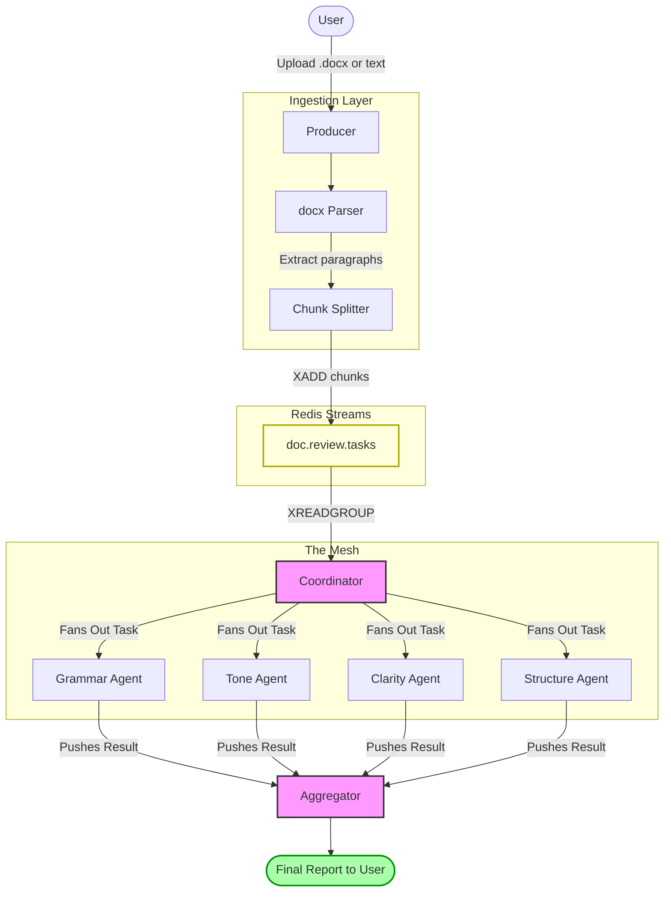
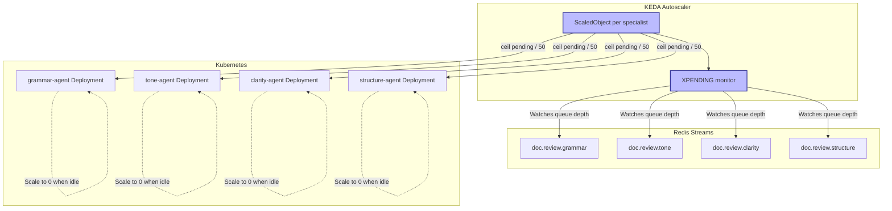

# Agentic Mesh — Tutorial & Reference Implementation

> **Learn the Agentic Mesh Principle:** A pragmatic approach to building scalable, decoupled multi-agent distributed systems with Redis Streams and Python.

This repository is a fully working tutorial and reference implementation. It demonstrates how to decompose an AI document processing pipeline into a **mesh of independent, stream-connected agents** — each deployable, scalable, and testable in isolation.

---

## What You Will Learn

| Concept | What the Code Demonstrates |
|---|---|
| **Agentic Mesh Principle** | Specialist agents (Grammar, Tone, Clarity, Structure) collaborate with zero direct coupling |
| **Event-Driven Coordination** | A Coordinator fans out tasks dynamically via Redis Streams |
| **Resilient Messaging** | Redis Consumer Groups guarantee at-least-once delivery and load balancing |
| **Horizontal Scalability** | Add replicas of any agent without changing any code |
| **Kubernetes-Native** | Full manifests for local-to-production deployment |
| **KEDA Autoscaling** | Scale agents to zero when idle; scale out by stream queue depth |

---

## Architecture

### Full Pipeline




### Autoscaling with KEDA + Kubernetes



> **Scaling formula:** `desired replicas = ceil(pendingMessages / 50)` — e.g. 175 pending messages → 4 grammar-agent pods. Scales to **zero** when streams are empty.

### Key Design Principles

- **No agent calls another agent directly** — all communication goes through named Redis Streams.
- **Ingestion is decoupled** — the Producer parses `.docx` into chunks and publishes to Redis independently of processing speed.
- **Consumer Groups** load-balance automatically — add replicas of any agent without changing a single line of code.
- **The Coordinator is stateless** — it reads one raw task and writes N sub-tasks; swappable without touching specialists.
- **KEDA watches the real signal** — queue depth, not CPU. Agents that block on `XREADGROUP` show low CPU even when overloaded; KEDA scales them correctly.
- **Scale to zero** — specialist pods terminate when idle, saving cost in Kubernetes.


### Stream Map

| Stream | Written By | Read By | Consumer Group |
|---|---|---|---|
| `doc.review.tasks` | Producer | Coordinator | `coordinator-group` |
| `doc.review.grammar` | Coordinator | Grammar Agent | `grammar-group` |
| `doc.review.clarity` | Coordinator | Clarity Agent | `clarity-group` |
| `doc.review.tone` | Coordinator | Tone Agent | `tone-group` |
| `doc.review.structure` | Coordinator | Structure Agent | `structure-group` |
| `doc.suggestions.*` | Specialist Agents | Aggregator | `aggregator-group` |
| `doc.review.summary` | Aggregator | User / API | — |

---

## Project Structure

```
agentic-mesh/
├── src/
│   ├── agents/
│   │   ├── coordinator.py       # Fan-out logic: reads tasks, writes to specialist streams
│   │   ├── specialists.py       # Grammar, Clarity, Tone, Structure agents + audit tagging
│   │   └── aggregator.py        # Collects all specialist results, writes final summary
│   ├── ingestion/
│   │   └── producer.py          # Reads .docx or simulates paragraphs → XADD to tasks stream
│   ├── core/
│   │   └── redis_client.py      # Shared Redis connection and stream helpers
│   └── main.py                  # Unified CLI: coordinator | specialist | aggregator | produce | start-all
├── k8s/
│   ├── redis.yaml               # StatefulSet + headless Service
│   ├── configmap.yaml           # Shared env (REDIS_HOST, REDIS_PORT)
│   ├── coordinator.yaml         # Coordinator Deployment
│   ├── specialists.yaml         # One Deployment per specialist type
│   ├── aggregator.yaml          # Aggregator Deployment
│   ├── producer-job.yaml        # One-shot Job for triggering a document run
│   └── keda-scalers.yaml        # ScaledObjects: scale agents by Redis pending message count
├── docs/
│   ├── kubernetes_deployment.md # Full K8s + KEDA guide with YAML and scaling explanation
│   ├── redis_architecture.md    # Detailed Redis stream diagram
│   ├── interaction_flow.md      # Sequence diagram of a full document lifecycle
│   ├── mesh_execution_report.md # Step-by-step Redis CLI walkthrough
│   ├── redis_cli_manual.md      # Redis commands reference for this project
│   └── spec.md                  # Full system specification
├── docker-compose.yml           # Local multi-agent setup with Redis
├── Dockerfile                   # Single image — role selected at runtime via CLI args
├── create_dummy_docx.py         # Helper: generate a test .docx file
└── check_results.py             # Helper: print aggregated results from Redis
```

---

## Prerequisites

- **Python 3.12+** managed by [`uv`](https://docs.astral.sh/uv/)
- **Redis 7+** (local or via Docker)

### Start Redis

**Docker (recommended):**
```bash
docker run -d -p 6379:6379 --name redis-mesh redis:7-alpine
```

**Homebrew (macOS):**
```bash
brew install redis && brew services start redis
```

---

## Setup & Installation

```bash
# Install all dependencies (uses uv.lock for reproducibility)
uv sync

# Verify CLI is working
uv run python -m src.main --help
```

---

## Running Locally

### Option A — Full Mesh in One Command (Demo Mode)

Starts the Coordinator, all 4 Specialist Agents, and the Aggregator as parallel processes:

```bash
uv run python -m src.main start-all
```

### Option B — Individual Agents (for debugging)

```bash
uv run python -m src.main coordinator
uv run python -m src.main specialist --type grammar
uv run python -m src.main specialist --type clarity
uv run python -m src.main specialist --type tone
uv run python -m src.main specialist --type structure
uv run python -m src.main aggregator
```

### Option C — Docker Compose

```bash
docker compose up
```

---

## Producing Documents

In a **separate terminal**, inject a document into the mesh:

**Simulated paragraphs:**
```bash
uv run python -m src.main produce --doc_id "sim-001" --paragraphs 5
```

**Real `.docx` file:**
```bash
# Generate a test file first (optional)
uv run python create_dummy_docx.py

# Inject it
uv run python -m src.main produce --file dummy_test.docx --doc_id "docx-001"
```

Each specialist appends an audit tag to verify the flow: `[AI SERVICE: GRAMMAR DONE]`, `[AI SERVICE: TONE DONE]`, etc.

---

## Checking Results

```bash
# Pretty-print the aggregated results stored in Redis
uv run python check_results.py
```

For a deep-dive walk-through of each Redis command as the mesh runs, see the **[Mesh Execution Report](./docs/mesh_execution_report.md)**.

---

## Kubernetes Deployment

The entire system runs natively on Kubernetes. Each agent is a separate `Deployment`; the Producer is a `Job`; Redis is a `StatefulSet`.

### Quick Deploy

```bash
# 1. Create namespace
kubectl create namespace agentic-mesh

# 2. Shared config
kubectl apply -f k8s/configmap.yaml

# 3. Redis (wait for readiness before proceeding)
kubectl apply -f k8s/redis.yaml
kubectl wait --for=condition=ready pod -l app=redis -n agentic-mesh --timeout=60s

# 4. All agents
kubectl apply -f k8s/coordinator.yaml
kubectl apply -f k8s/specialists.yaml
kubectl apply -f k8s/aggregator.yaml

# 5. Trigger a test run
kubectl apply -f k8s/producer-job.yaml
```

### Manual Scaling

```bash
# Scale grammar agent to 4 replicas when queue is backing up
kubectl scale deployment grammar-agent --replicas=4 -n agentic-mesh
```

Redis Consumer Groups distribute messages across all replicas automatically. **No code changes required.**

### Autoscaling with KEDA (Recommended)

[KEDA](https://keda.sh) scales agents based on Redis stream pending message depth — the exact meaningful signal for this architecture:

```bash
# Install KEDA
helm repo add kedacore https://kedacore.github.io/charts && helm repo update
helm install keda kedacore/keda --namespace keda --create-namespace

# Apply ScaledObjects for all specialists
kubectl apply -f k8s/keda-scalers.yaml
```

KEDA will automatically:
- **Scale out** when messages queue up (e.g., 300 pending → 6 grammar-agent replicas)
- **Scale to zero** when streams are empty (saves cost when idle)

See the **[full Kubernetes & KEDA guide](./docs/kubernetes_deployment.md)** for manifests, scaling tables, and the complete autoscaling lifecycle explanation.

---

## Documentation Index

| Document | Description |
|---|---|
| [Kubernetes Deployment](./docs/kubernetes_deployment.md) | All K8s manifests, KEDA ScaledObjects, scaling strategy |
| [Redis Architecture](./docs/redis_architecture.md) | Detailed Redis Streams and Consumer Groups diagram |
| [Interaction Flow](./docs/interaction_flow.md) | Sequence diagram of a full document processing lifecycle |
| [Mesh Execution Report](./docs/mesh_execution_report.md) | Step-by-step annotated Redis CLI walkthrough |
| [Redis CLI Manual](./docs/redis_cli_manual.md) | All Redis commands used in this project |
| [System Spec](./docs/spec.md) | Full functional and technical specification |

---

## Extension Exercise

The specialist agents currently simulate LLM processing with a sleep + audit tag. To make this production-ready:

1. Open `src/agents/specialists.py`
2. Replace the simulated logic with a real LLM API call (OpenAI, Anthropic, Ollama, etc.)
3. Re-deploy — the mesh, Redis streams, and Kubernetes manifests require **zero changes**

This is the point of the architecture: **the communication fabric is decoupled from the intelligence inside each agent.**
