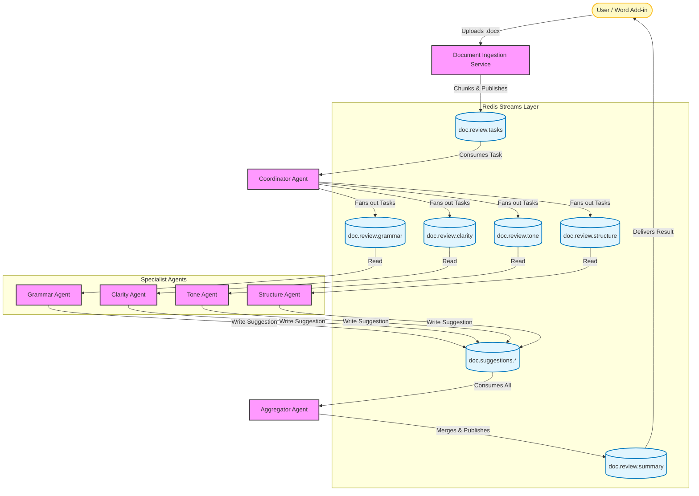

# Component Interaction Graph

This document visualizes the flow of data and interaction between the components of the Word Document Suggestion Mesh.

## System Flow Architecture

## Component Breakdown

### 1. User / Word Add-in
*   **Type**: Client / End-User
*   **Role**: Initiates the process by uploading a document and receives final suggestions to display to the user.
*   **Interaction**: Sends `.docx` files to the Ingestion Service; Lists on `doc.review.summary` for results.

### 2. Document Ingestion Service
*   **Type**: Producer Service
*   **Role**: Prepares the document for processing.
*   **Action**: 
    *   Parses the raw `.docx` file.
    *   Splits content into manageable chunks (e.g., paragraphs).
    *   Assigns unique IDs (`doc_id`, `chunk_id`).
    *   Publishes chunks to the `doc.review.tasks` stream.

### 3. Coordinator Agent
*   **Type**: Orchestrator
*   **Role**: Manages the workflow for each document chunk.
*   **Action**:
    *   Reads from `doc.review.tasks`.
    *   Determines which reviews are needed (e.g., maybe a user only requested Grammar and Tone check).
    *   Fans out specific sub-tasks to relevant streams (`doc.review.grammar`, `doc.review.tone`, etc.).

### 4. Specialist Agents
Independent workers focused on specific domains. They scale horizontally.

*   **Grammar Agent**: detailed syntax and grammatical error checking.
*   **Clarity Agent**: focuses on readability, sentence length, and active voice.
*   **Tone Agent**: analyzes sentiment and formality level (e.g., Professional vs. Casual).
*   **Structure Agent**: reviews logical flow, heading hierarchy, and paragraph transitions.

**Action**: They read their specific `doc.review.*` stream, process the text using NLP/LLMs, and write results to `doc.suggestions.*`.

### 5. Aggregator Agent
*   **Type**: Synthesizer
*   **Role**: Combines fragmented insights into a coherent report.
*   **Action**:
    *   Reads all messages from `doc.suggestions.*`.
    *   Groups suggestions by `doc_id` and `chunk_id`.
    *   Resolves conflicts (e.g., if Grammar and Clarity agents suggest conflicting edits for the same sentence).
    *   Formats the final output.
    *   Publishes the consolidated report to `doc.review.summary`.
