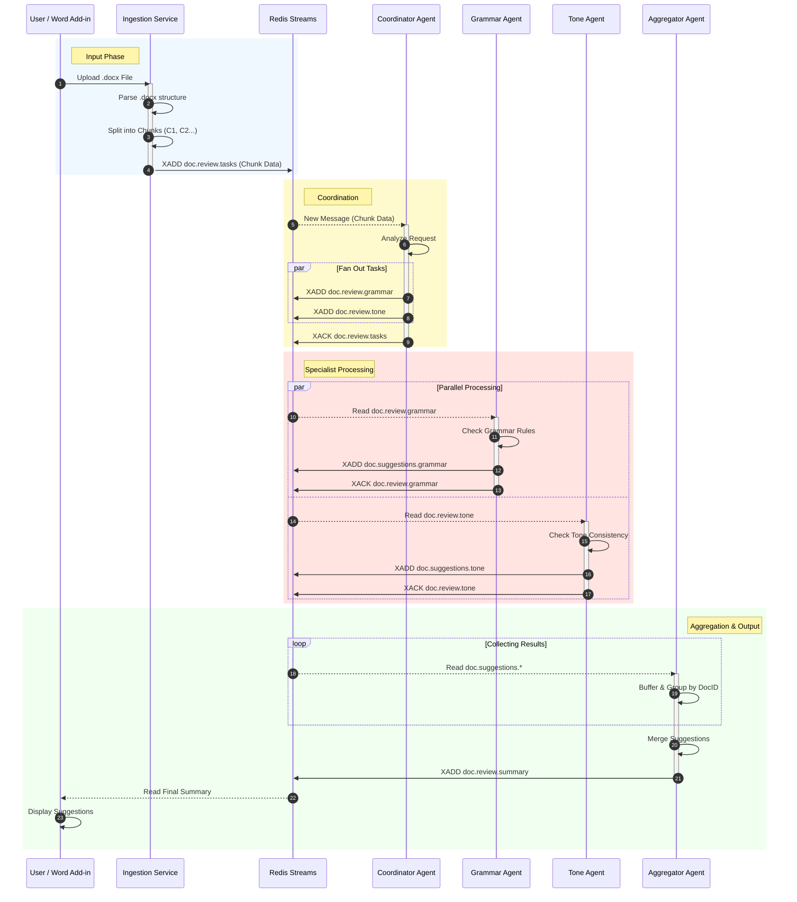

# System Interaction Flow

This document details the interaction sequences and data flow states of the Word Document Suggestion Mesh.

## 1. Sequence Diagram: Document Processing Lifecycle

This diagram shows the step-by-step interaction between components over time, from upload to final suggestion delivery.

## 2. Interaction Explanation

### Phase 1: Input
The **User** uploads a file. The **Ingestion Service** acts as the boundary, converting the binary `.docx` file into discrete, text-based tasks stored in **Redis**. This decouples the upload speed from the processing speed.

### Phase 2: Coordination
The **Coordinator Agent** picks up the raw text chunk. It decides *what* needs to be done. If the user only requested a grammar check, it would only publish to `doc.review.grammar`. In this diagram, it fans out to both **Grammar** and **Tone** streams.

### Phase 3: Specialist Processing
The **Grammar** and **Tone agents** work in parallel. They are completely unaware of each other ("shared nothing architecture"). They read their specific tasks, perform CPU-heavy AI processing, and write their findings to a common `doc.suggestions.*` pattern.

### Phase 4: Aggregation
The **Aggregator** listens to *all* suggestion channels. It waits until it has received feedback from all expected agents for a specific chunk (or hits a timeout). It then merges these separate JSON objects into a single, cohesive result and publishes it to the summary stream for the **User** to consume.
