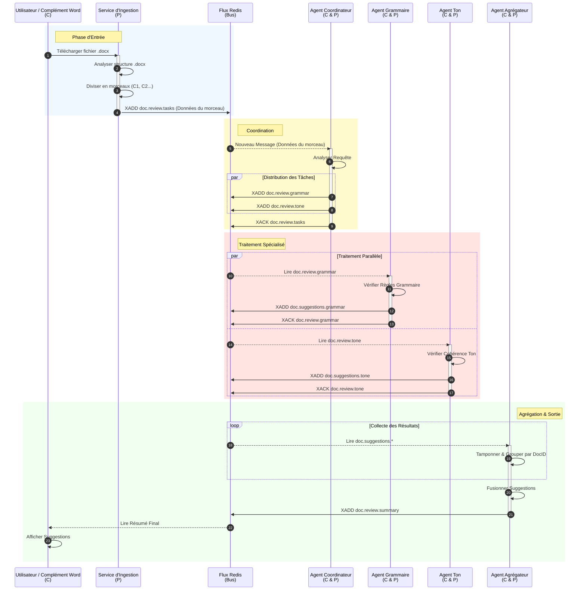

# Flux d'Interaction du Système

Ce document détaille les séquences d'interaction et les états du flux de données du Maillage de Suggestion de Documents Word.

## 1. Diagramme de Séquence : Cycle de Traitement du Document

Ce diagramme montre l'interaction étape par étape entre les composants au fil du temps, du téléchargement à la livraison finale des suggestions.

## 2. Explication de l'Interaction

### Phase 1 : Entrée
L'**Utilisateur** (Producteur de fichier) télécharge un fichier. Le **Service d'Ingestion** (Producteur de Tâches) agit comme la frontière, convertissant le fichier binaire `.docx` en tâches discrètes basées sur du texte stockées dans **Redis**. Il *produit* des messages dans le flux `doc.review.tasks`.

### Phase 2 : Coordination
L'**Agent Coordinateur** est à la fois **Consommateur** (il lit les tâches brutes) et **Producteur** (il *produit* des demandes de revue spécifiques). Il décide *ce qui* doit être fait. Si l'utilisateur a uniquement demandé une vérification grammaticale, il ne *produira* des messages que vers `doc.review.grammar`.

### Phase 3 : Traitement Spécialisé
Les **agents Grammaire** et **Ton** (Consommateurs & Producteurs) travaillent en parallèle. Ils *consomment* leurs tâches spécifiques depuis Redis, effectuent un traitement IA intensif, et *produisent* leurs conclusions (suggestions) vers un modèle commun `doc.suggestions.*`.

### Phase 4 : Agrégation
L'**Agent Agrégateur** (Consommateur Final & Producteur de Résumé) *consomme* tous les canaux de suggestion. Il attend d'avoir reçu les retours de tous les agents attendus pour un morceau spécifique. Il fusionne ensuite ces objets JSON séparés en un résultat unique et cohérent, et *produit* le rapport final dans le flux de résumé pour que l'**Utilisateur** (Consommateur Final) puisse le lire.
