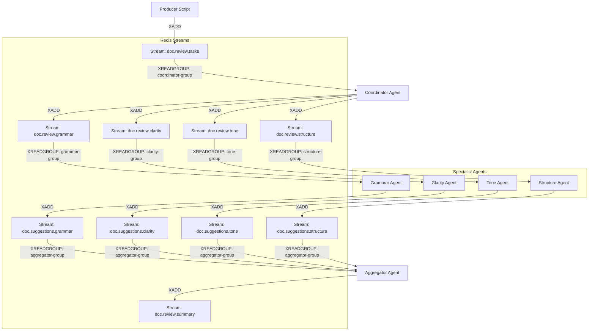

# Redis Stream Architecture

This diagram details the specific Redis Streams and Consumer Groups implementation in the system.

## Redis Implementation Diagram

## Key Redis Commands Used

| Action | Command | Python Implementation |
| :--- | :--- | :--- |
| **Publishing Tasks** | `XADD key * field value` | `redis_client.xadd(stream, payload)` |
| **Consuming Tasks** | `XREADGROUP GROUP group consumer STREAMS key >` | `redis_client.xreadgroup(...)` |
| **Acknowledge** | `XACK key group id` | `redis_client.xack(...)` |
| **Create Group** | `XGROUP CREATE key group $ MKSTREAM` | `redis_client.xgroup_create(...)` |
