# Redis Architecture Manual Diagram

This diagram visualizes the flow of messages through Redis Streams as documented in the `redis_cli_manual.md`.

```mermaid
graph TD
    %% Producers and Inward tasks
    producer["Producer/Ingestion"] -->|XADD| task_stream[("doc.review.tasks")]
    
    %% Coordinator Logic
    subgraph group_coord ["Coordinator Group"]
        coord_agent["Coordinator Agent"]
        coord_agent -.->|XREADGROUP| task_stream
        coord_agent -.->|XACK| task_stream
    end
    
    coord_agent -->|XADD| grammar_stream[("doc.review.grammar")]
    coord_agent -->|XADD| clarity_stream[("doc.review.clarity")]
    coord_agent -->|XADD| tone_stream[("doc.review.tone")]
    coord_agent -->|XADD| structure_stream[("doc.review.structure")]

    %% Specialists Logic
    subgraph group_spec ["Specialist Groups"]
        direction LR
        spec_grammar["Grammar Agent"]
        spec_clarity["Clarity Agent"]
        spec_tone["Tone Agent"]
        spec_structure["Structure Agent"]
    end

    spec_grammar -.->|XREADGROUP| grammar_stream
    spec_clarity -.->|XREADGROUP| clarity_stream
    spec_tone -.->|XREADGROUP| tone_stream
    spec_structure -.->|XREADGROUP| structure_stream

    spec_grammar -->|XADD| sugg_grammar[("doc.suggestions.grammar")]
    spec_clarity -->|XADD| sugg_clarity[("doc.suggestions.clarity")]
    spec_tone -->|XADD| sugg_tone[("doc.suggestions.tone")]
    spec_structure -->|XADD| sugg_structure[("doc.suggestions.structure")]

    spec_grammar -.->|XACK| grammar_stream
    spec_clarity -.->|XACK| clarity_stream
    spec_tone -.->|XACK| tone_stream
    spec_structure -.->|XACK| structure_stream

    %% Aggregator Logic
    subgraph group_agg ["Aggregator Group"]
        agg_agent["Aggregator Agent"]
        agg_agent -.->|XREADGROUP| sugg_grammar
        agg_agent -.->|XREADGROUP| sugg_clarity
        agg_agent -.->|XREADGROUP| sugg_tone
        agg_agent -.->|XREADGROUP| sugg_structure
    end

    agg_agent -->|XADD| summary_stream[("doc.review.summary")]
    agg_agent -.->|XACK| sugg_grammar
    agg_agent -.->|XACK| sugg_clarity
    agg_agent -.->|XACK| sugg_tone
    agg_agent -.->|XACK| sugg_structure

    %% Styling
    classDef stream fill:#f9f,stroke:#333,stroke-width:2px;
    class task_stream,grammar_stream,clarity_stream,tone_stream,structure_stream,sugg_grammar,sugg_clarity,sugg_tone,sugg_structure,summary_stream stream;
```

## Key Commands Used in Diagram

- **XADD**: Add a message to a stream (Solid arrows).
- **XREADGROUP**: Read new messages as part of a group (Dashed arrows).
- **XACK**: Acknowledge processing of a message (Dashed lines back to stream).
- **Consumer Groups**: Represented as logical subgraphs encompassing the agents.
