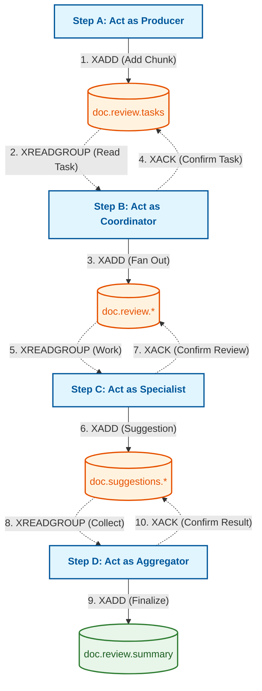

# Redis CLI Manual Flow Diagram

This diagram visualizes the interactive manual process for simulating the agentic mesh via CLI.

## Description of Interactions

- **Solid Lines**: `XADD` commands that push data forward into the next stage.
- **Dashed Lines**: `XREADGROUP` and `XACK` commands that manage the lifecycle of a message within a consumer group.
